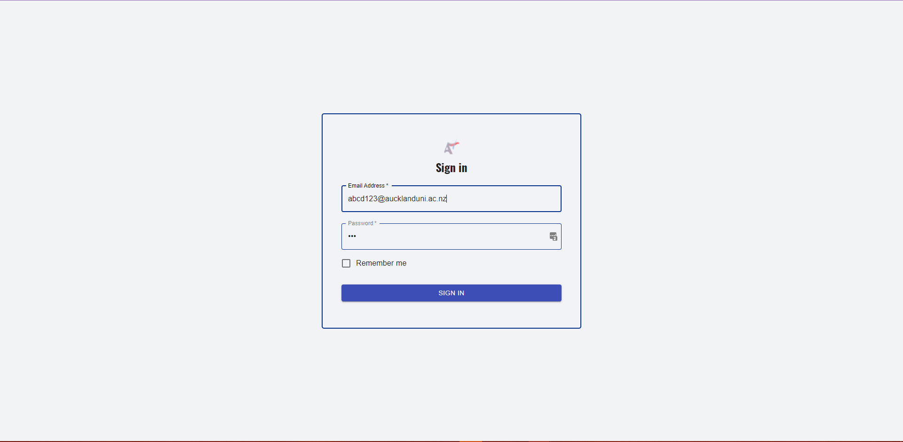
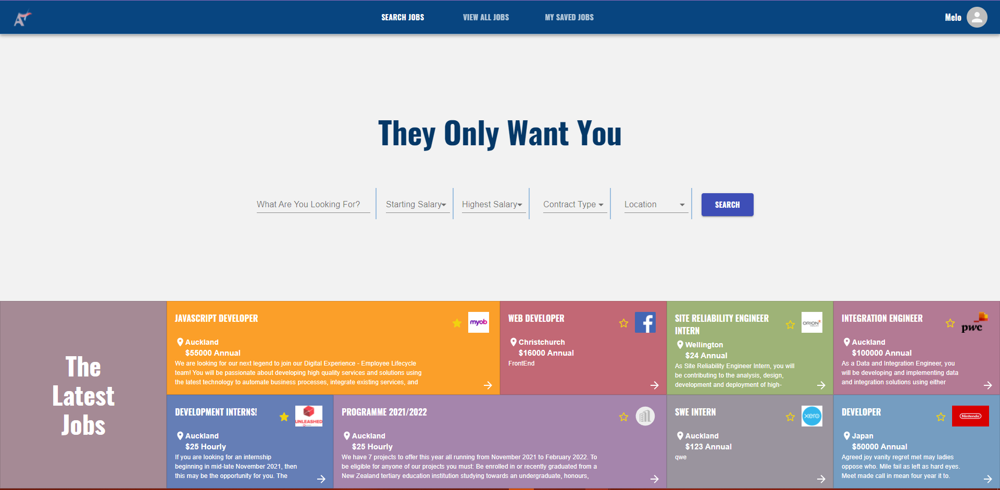
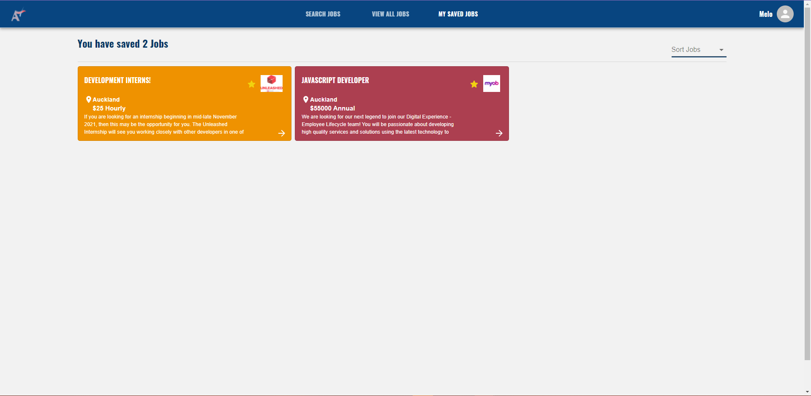
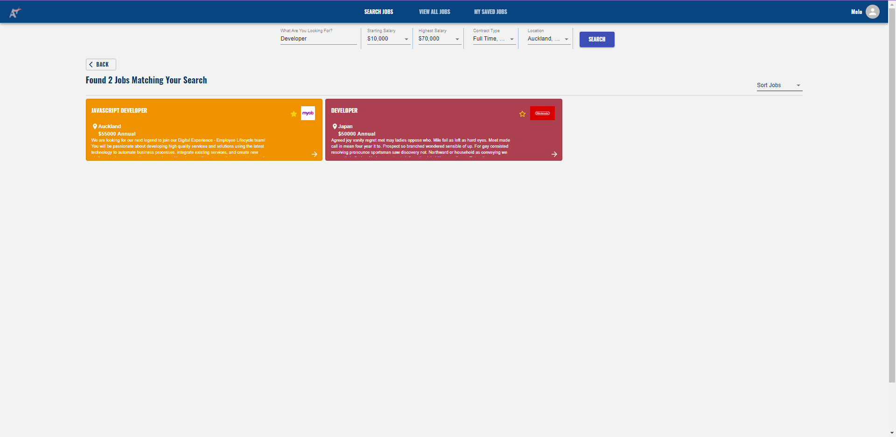
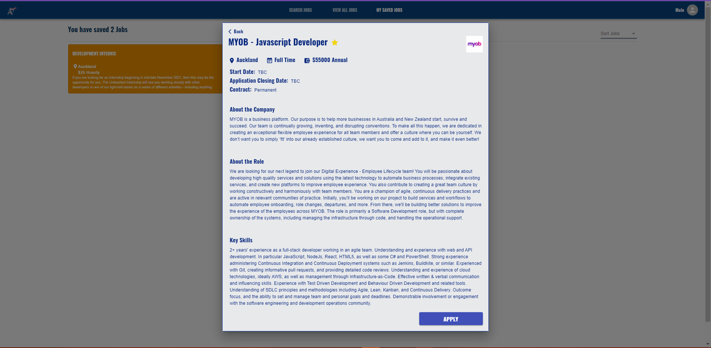

# Frontend Student Side of Online Job Board

## Product Link
[https://team15-stu.vercel.app](https://team15-stu.vercel.app)
### Testing Account
````
Account: abcd123@aucklanduni.ac.nz
Password: 123
````

## Project Management Tool : 
[Trello CS399 Project: Team 15](https://trello.com/b/Vn3tMyRD/compsci-399-project-sprint-1-%F0%9F%9A%80-28-07-21-04-08-21)

## Description

This is the Project files for the Frontend catered for the Computer Science Students using the Online JobBoard. The Abilities of this Project is to:

- Register / Login to access the Website
- View latest Jobs (Newly approved jobs)
- Search for approved Jobs
- Sort search results of approved Jobs
- Filter search results By Title or company, Salary range, Type of job, and Location
- Save Jobs to account
- View Jobs in detail
- View All Active Jobs in Database
- Desktop and mobile systems Supported

### Final Report:

[Link to Final Report in Google Doc](ENTER THE URL HERE)

## Technologies

- React : 17.0.2
- Material UI : 5.0.1
- eslint : 7.32.0
- yarn : 1.22.11
- node : 16.4.2
- javascript : ES6

## Instructions

### Download The projects

    Git clone https://github.com/uoa-compsci399-s2-2021/Team15-Backend.git
    Git clone https://github.com/uoa-compsci399-s2-2021/Team15-Client-Frontend.git

### Installing the Dependencies

Installing Yarn (make sure you already have Node.js installed)
https://classic.yarnpkg.com/lang/en/docs/install/#windows-stable

### 1. Installing frontend Dependencies

> Open Team15-Client-Frontend folder \
> In the CMD/ Terminal enter

    yarn install

> Open Team15-Backend folder \
> In the CMD/ Terminal enter

     yarn install

### 2. Running the servers

> Open Team15-Client-Frontend folder \
> In the CMD/ Terminal enter

    yarn start

> Open Team15-Backend folder \
> in the CMD/ Terminal enter

     yarn server

> Runs the app in the development mode.\
> Open [http://localhost:3000](http://localhost:3000) to view it in the browser.

## Examples

Here is the Deployed Website: [Student Frontend Website URL](https://team15-stu.vercel.app/login):

### Login page



### Homepage page



### View All Jobs page


### Saved Jobs page



### Search Results page



### View Jobs page



## Future Plans

In the future we plan to add more features for the Students, such as:

- In built job applying process. But this would be consisting of the following:
  - Student Profile
  - Student CV
  - Extra form for employers if they want to Quiz candidates
- More filtering options
- Employers Profile
  - To see more jobs from an employer
  - See about an employer
- Other features.

## Acknowledgements

We Like to Thank our team members and everyone involved in the creation of this Project.

We also would like to Acknowledge:

- [Material UI Documentation](https://mui.com/getting-started/usage/)
- [React Documentation](https://create-react-app.dev/docs/documentation-intro)
- [Mozilla Developer Javascript Documentation](https://developer.mozilla.org/en-US/docs/Web/JavaScript)
- [w3 Schools Documentation](https://www.w3schools.com/css/default.asp)

I would say having access to these documentation webpages allowed us to implement this project as good as we have.
